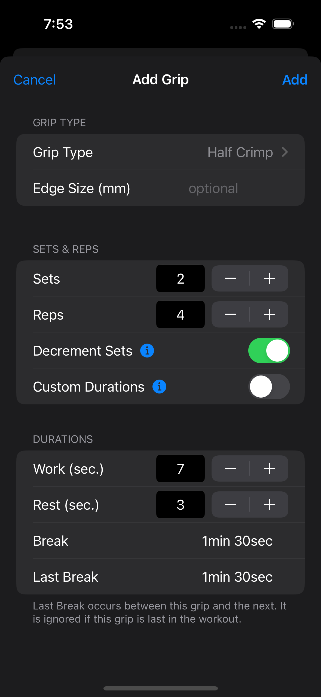
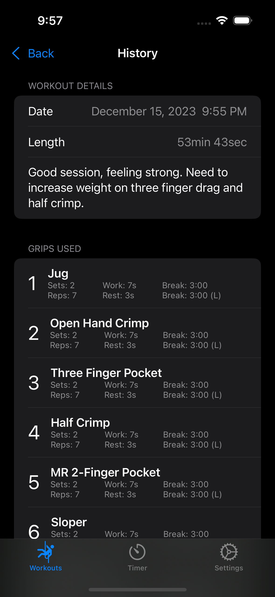

# CountDown - Hangboard Training App for iOS

  

  

## About
CountDown is a simple, user-friendly, and free iOS application that allows users
to build and execute their own custom hangboard workouts. Users can build 
workouts within a matter of minutes by adding grips of their choice to their
workout.

### Key Features
- Create and execute custom workouts
- Create new workouts with ease by adding, copying, and reordering grips within a workout
- Simple and informative UI that depicts the current progess of the timer and workout
- Build an ad-hoc timer in a matter of seconds when a full workout is not needed
- Track workout progress by viewing your workout history and adding notes
- Customize timer feedback by choosing between sound or vibration
- Create custom grip types that can be reused between different grips and workouts

## License
This app uses the GNU Affero General Public License. Copying and redistribution
is allowed, but modification is not. See LICENSE for more details.

## System Requirements
iOS 16.2+ is required to install the app.

## Need Help?
If you have problems, need help with the app, or have bugs to report please use the
Issues tab above to submit a new issue.

## Screenshots
  
  
 
  
 
  
 
  
 
  
 
  
 
  
 
  
 